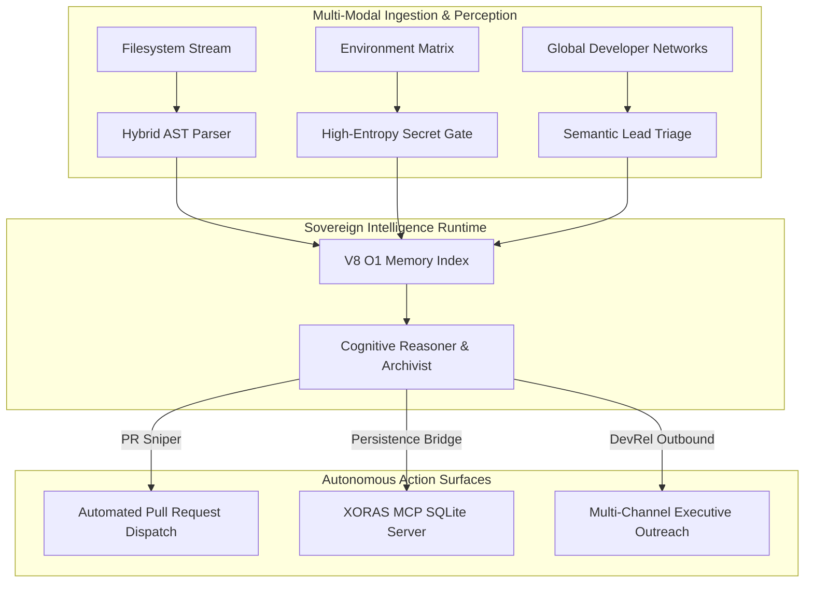

# System Architecture: The Versatile Agentic Grid
**AST Reasoning, O(1) Memory Ledger Indexing, and Autonomous RevOps Orchestration.**

---

## 1. The Agentic Cognitive Core
The XORAS ecosystem operates at the intersection of structural AST verification and autonomous agentic reasoning. The core engine functions as an adaptive intelligence grid capable of continuous self-healing, child process orchestration, and real-time AST verification.



---

## 2. Core Architectural Tranches

### 2.1 The Cognitive Memory Ledger (`MemoryLedger`)
To eliminate the latency and locking constraints of direct disk I/O under high concurrency, the runtime maintains dual V8 Maps (`this.cache` grouped by status and `this.itemIndex` keyed by unique SHA-256 identities):
*   **Sub-Millisecond Indexing:** O(1) lookup guarantees instant state transition across all six stages of the RevOps loop.
*   **Garbage Collection Optimization:** Eliminates memory leak accumulation and linear heap growth under sustained enterprise workloads.

### 2.2 Hybrid AST Precision Engine
Rather than relying on fragile regex string matching, the engine constructs abstract syntax trees for target JavaScript and TypeScript files:
*   **Next.js 15 Asynchronous Route Verification:** Dynamically traverses route handlers to enforce correct asynchronous parameter destructuring (`await params`).
*   **Structural Secret Trapping:** Evaluates token entropy and AST context to prevent false positives while maintaining absolute zero-leakage security.

### 2.3 The Model Context Protocol (MCP) Persistence Bridge
The runtime connects to dedicated MCP servers (`XORAS_MCP_SERVER`) to synchronize state across distributed agent clusters:
*   **Relational SQLite Auditing:** Ingests persistent audit events and reconstructs repository memory caches instantly upon startup.
*   **Serverless Edge Parity:** Gated by standardized POSIX exit statuses (Code 0 success / Code 1 tamper trap) to ensure runtime environment parity.

---

## 3. Autonomous Execution Surfaces

```text
┌─────────────────────────────────────────────────────────────────┐
│                       XORAS AGENTIC RUNTIME                     │
├─────────────────┬─────────────────────────────┬─────────────────┤
│   CI/CD SENTRY  │   UNIVERSAL REVOPS LOOP     │  CEO EXECUTIVE  │
│ Pre-commit gate │ 6-stage sniper & dispatcher │ Social & Growth │
└─────────────────┴─────────────────────────────┴─────────────────┘
```

The XORAS architecture scales across three execution vectors:
1.  **Local Pre-Commit Sentry:** Instant local AST scanning and cryptographic manifest locking (`integrity.lock`).
2.  **Autonomous RevOps Master:** Continuous background execution of PR monitoring, triage, and DevRel closer daemons.
3.  **CEO Social & Growth Orchestrator:** High-level executive agent routing commercial partnerships and DevRel communications to authorized channels (`arvant.apex@gmail.com`).
